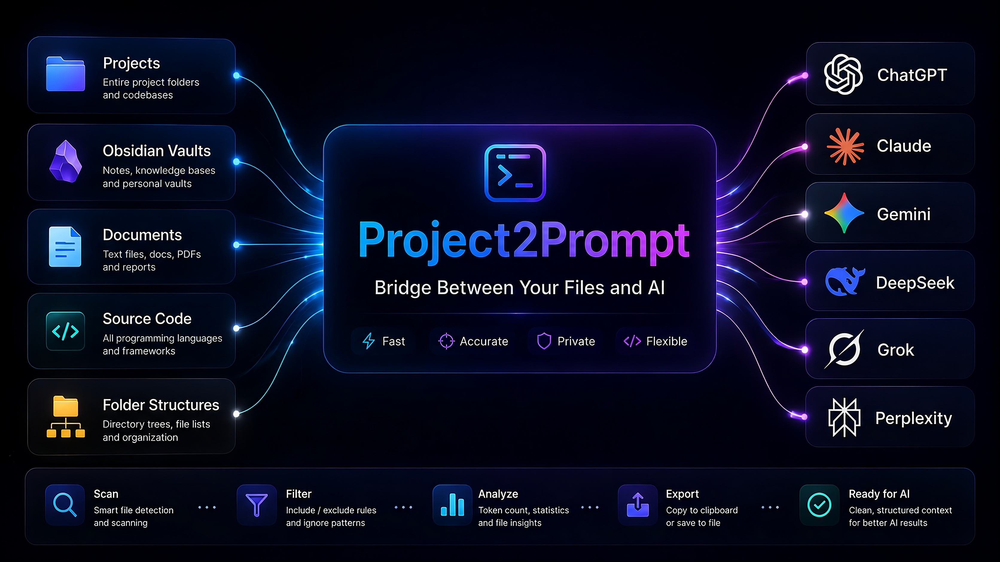
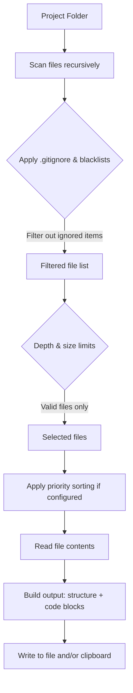

# Project2Prompt




**Bridge Between Your Files and AI** – export any project folder or repository into a single, neatly formatted file. Ideal for quick AI-assisted code review, debugging, and refactoring. The tool recursively collects source files, wraps them in fenced code blocks with relative paths, filters noise (like `node_modules`, `.git`, images), and produces a paste-ready output or copies it straight to your clipboard.

## Why Project2Prompt?
- **Full project context in one paste** – feed the entire codebase to ChatGPT, Claude, Gemini, DeepSeek, and others without manual copying.
- **Faster code review & debugging** – get a consolidated snapshot and ask focused questions about structure, bugs, or refactoring.
- **Reproducible context** – relative paths and stable file ordering help AI (or human reviewers) follow the project layout.
- **Smart filtering** – automatically ignore binaries, images, and common vendor/cache folders, keeping the export lean and relevant.
- **Ready for anything** – code reviews, pair‑programming sessions, student tutoring, onboarding, audits, and issue reproduction.

## Table of Contents

- [Features](#features)
- [Prerequisites](#prerequisites)
- [Installation](#installation)
- [Quickstart](#quickstart)
  - [CLI Reference](#cli-reference)
- [Sample output](#sample-output)
- [How It Works](#how-it-works)
- [Configuration](#configuration)
- [Advanced Usage & Tips](#advanced-usage--tips)
  - [Priority file ordering](#priority-file-ordering)
  - [Configuration inheritance](#configuration-inheritance)
  - [Disabling update notifications](#disabling-update-notifications)
  - [Re‑export loop details](#re-export-loop-details)
- [Contributing](#contributing)

## Features
- Recursive directory scanning with a progress bar.
- **Multiple configuration profiles** – place `.py` files in `configs/` (any subdirectory) and pick one at startup. Each profile can have a short `CONFIG_DESCRIPTION` shown in the selection menu.
- Configurable ignore rules for directories, filenames, and extensions (per profile).
- Filename filtering with exact or partial matching (`FILENAME_FILTER_MODE`).
- **`.gitignore` integration** – automatically respect `.gitignore` rules when `USE_GITIGNORE = True`.
- **Depth limit** – restrict recursion with `MAX_DEPTH` (useful for large monorepos).
- Whitelist for extensionless files (e.g. `Dockerfile`, `Makefile`).
- Export project structure (ASCII tree) and file contents separately.
- Optionally show empty directories (`SHOW_EMPTY_DIRS`) and include empty files (structure only, no code block, `INCLUDE_EMPTY_FILES`).
- Save output to a file and/or copy to the clipboard.
- Clipboard safety limit to avoid accidentally pasting huge text.
- **Extended statistics** – file tree, token estimate, summary of skipped files, top file extensions, and the 5 largest files included.
- **Priority‑based file ordering** – define `PRIORITY_PATTERNS` and `LOW_PRIORITY_PATTERNS` to control the output order.
- **Update check** – optionally queries GitHub for newer releases (configurable via `app_config.py`).
- **Interactive re‑export loop** – after an export, press Enter to run again with the same config (hot‑reloading edits), type a number to switch to another config, or `N` to exit.
- Works with CLI or a GUI folder picker (Tkinter).

## Prerequisites
- **Python 3.10** or higher.
- **Required packages** (installed automatically, see Installation):
  - `rich` – coloured console output and progress bar.
  - `tiktoken` – token count estimation (uses `o200k_base` encoding).
  - `pathspec` – parsing `.gitignore` patterns.
  - `pyperclip` – cross‑platform clipboard support (fallback to native utilities if missing).
- **Linux only**: if `pyperclip` is unavailable, at least one of `xclip` or `xsel` must be installed for clipboard functionality.

## Installation
1. Clone the repository or download the source.
2. Install dependencies:

```powershell
pip install -r requirements.txt
```

Alternatively, install the core packages manually (not recommended for full feature set):

```powershell
pip install rich tiktoken pathspec pyperclip
```

## Quickstart
1. Open a terminal in the `Project2Prompt` folder.
2. Run:

```powershell
python main.py
```

Or provide a folder, output file, and configuration directly:

```powershell
python main.py -d "C:\path\to\project" -o export.txt -c python
```

### CLI Reference
| Argument | Short | Description |
|----------|-------|-------------|
| `--directory` | `-d` | Path to the project directory. If omitted, a graphical folder picker opens (falls back to console input). |
| `--output` | `-o` | Output file name. Relative paths are placed inside the effective output directory (`OUTPUT_DIR/config_name/`). If not given, the configuration’s default name is used with a sequential suffix (`_1`, `_2`, …) to avoid overwrites. |
| `--config` | `-c` | Name of the configuration file. Accepts a path relative to `configs/` (e.g., `python` → `configs/python.py`), an absolute path, or a path relative to the current working directory. If the name lacks a `.py` extension and is not found, `.py` is appended automatically. When not specified, the tool auto‑selects the only config (if exactly one exists), shows an interactive tree menu for multiple configs, or falls back to a root `config.py`. |

Clipboard support is cross‑platform: `pyperclip` is preferred, with native fallbacks (`clip`, `pbcopy`, `xclip`/`xsel`).

## Sample output
Every file appears with a relative path header and a fenced code block:

````
src/main.py:
```python
def hello():
    print("Hello World")
```
````

If `EXPORT_STRUCTURE` is enabled (default), the output starts with a project tree:

````
# Project Directory Structure:
myproject/
├── src/
│   ├── main.py
│   └── utils/
│       └── helpers.py
└── README.md

# BEGIN FILE CONTENTS

src/main.py:
```python
def main():
    print("Hello")
```
````

Empty files are shown in the tree but get no code block (`INCLUDE_EMPTY_FILES`). Empty directories appear only when `SHOW_EMPTY_DIRS` is `True`.

## How It Works



1. **Scanning** – the directory is walked recursively, skipping blacklisted/hidden directories and applying `.gitignore` (if enabled). Depth limit is enforced during traversal.
2. **Filtering** – files are checked against extension/name blacklists, size limits, and the extensionless‑whitelist. A progress bar tracks the work.
3. **Sorting** – if `PRIORITY_PATTERNS` are defined, files are reordered according to the priority tiers; within each tier they’re sorted by directory depth and alphabetically.
4. **Content reading** – each remaining file is read with automatic encoding detection (UTF‑8, CP1251, Latin‑1). Binary/unreadable files are skipped.
5. **Output assembly** – an ASCII tree of the project structure is generated (optionally showing empty directories), followed by all file contents in language‑detected fenced code blocks.
6. **Delivery** – the final string is written to a file and/or copied to the clipboard (subject to the clipboard character limit).

## Configuration
Configuration files live inside the `configs/` folder (legacy `config.py` in the project root is also supported). Copy the supplied `config.py` into `configs/` and tweak it. You can maintain multiple profiles (e.g., `python.py`, `frontend.py`) and organise them into subdirectories. The selection menu displays a tree with continuous numbering, relative paths, and the optional `CONFIG_DESCRIPTION`.

**Output location** – the final file is placed inside `OUTPUT_DIR/config_name/`. For example, with `OUTPUT_DIR = "outputs"` and config `python.py`, files land in `outputs/python/`. The filename is taken from `OUTPUT_FILENAME` (or `-o`), possibly with a sequential suffix to prevent overwrites.

**Configuration description** – add a one‑line `CONFIG_DESCRIPTION` to any config file; it will appear next to the config name in the interactive tree.

Key options (inside a `.py` config file):

| Setting | Default | Description |
|---------|---------|-------------|
| `BLACKLIST_EXTENSIONS` | large set (see template) | File extensions to ignore (without dot). |
| `ALLOWED_EXTENSIONLESS_FILES` | `{"Dockerfile", "Makefile", "README", "LICENSE"}` | Extensionless files that should be included. |
| `BLACKLIST_DIRS` | `{"__pycache__", ".git", ".vscode", "node_modules", …}` | Directories to skip (by name). |
| `BLACKLIST_FILENAMES` | `{"setup.py", "requirements.txt"}` | Specific filenames to ignore. |
| `FILENAME_FILTER_MODE` | `"exact"` | Matching mode for `BLACKLIST_FILENAMES`: `"exact"` or `"contains"`. |
| `USE_GITIGNORE` | `True` (in template) | Respect `.gitignore` rules in addition to blacklists. **Note:** if the key is missing from a config file, it defaults to `False`. The provided template sets it to `True`. |
| `MAX_DEPTH` | `-1` | Max recursion depth: `-1` = unlimited, `0` = only selected directory, positive integer = max depth. |
| `OUTPUT_DIR` | `"outputs"` | Base directory for output files (a subfolder named after the config will be created automatically). |
| `OUTPUT_FILENAME` | `"output.txt"` | Base output file name (placed inside `OUTPUT_DIR/config_name/`). |
| `MAX_FILE_SIZE_MB` | `5` | Maximum file size in MB. Set to `0` to disable the limit (a reminder is shown). |
| `CREATE_FILE` | `True` | Whether to write the output file. If both `CREATE_FILE` and `COPY_TO_CLIPBOARD` are `False`, file output is enabled automatically. |
| `COPY_TO_CLIPBOARD` | `True` | Whether to copy the result to the clipboard. |
| `EXPORT_STRUCTURE` | `True` | Include the project structure tree in the output. |
| `EXPORT_CONTENT` | `True` | Include file contents (code) in the output. |
| `SHOW_EMPTY_DIRS` | `True` | When `EXPORT_STRUCTURE` is on, show empty directories. |
| `INCLUDE_EMPTY_FILES` | `True` | When `EXPORT_CONTENT` is on, include empty files (structure only, no code block). |
| `MAX_CLIPBOARD_CHARS` | `500000` | Max characters to copy to clipboard; `0` disables the limit. |
| `INPUT_DIR` (optional) | `""` | Preset project directory. Can be absolute, with `~`, or empty (always prompt). Overridden by `-d`. |
| `PRIORITY_PATTERNS` (optional) | `[]` | `fnmatch` patterns for high‑priority files (sorted first). |
| `LOW_PRIORITY_PATTERNS` (optional) | `[]` | `fnmatch` patterns for low‑priority files (sorted last). |

> **Note:** If both `EXPORT_STRUCTURE` and `EXPORT_CONTENT` are `False`, the tool will ask you to enable content export **for this run only** – it does **not** modify the configuration file.

Language detection for code fences uses a built‑in extension‑to‑language mapping (e.g., `.py` → `python`, `.js` → `javascript`). To add more mappings, edit `EXTENSION_LANGUAGE_MAP` in `exporter/processor.py`.

## Advanced Usage & Tips
- For large repositories, increase `MAX_FILE_SIZE_MB` (up to `0` for unlimited) or use `MAX_DEPTH` to limit traversal.
- Clipboard on Linux: install `pyperclip` or ensure `xclip`/`xsel` are present.
- Export **only the project structure** (no file contents) by setting `EXPORT_CONTENT = False`.
- If the output is too big for the clipboard, raise `MAX_CLIPBOARD_CHARS` or set it to `0`.
- Create multiple config profiles in `configs/` (even in subdirectories) and switch with `-c` or via the re‑export loop.
- Statistics show an approximate token count (vs a 128k context limit), helping you gauge whether the export fits common AI windows.
- In the re‑export loop, pressing **Enter** reloads the current config from disk – edits are picked up without restarting.

### Priority file ordering
Define `PRIORITY_PATTERNS` and `LOW_PRIORITY_PATTERNS` to control file order. Patterns are `fnmatch` rules matched against the full relative path. Files in `PRIORITY_PATTERNS` appear first (ordered by pattern index, then depth, then alphabetically); unmatched files follow; `LOW_PRIORITY_PATTERNS` files go last.

Example for a Python project:
```python
PRIORITY_PATTERNS = ["README*", "pyproject.toml", "src/*.py"]
LOW_PRIORITY_PATTERNS = ["requirements*.txt", "Pipfile*"]
```

### Configuration inheritance
Config files are pure Python – you can share settings by importing a base module:

```python
from configs.base import *
BLACKLIST_EXTENSIONS.add("sqlite")
```

This simplifies maintaining multiple profiles.

### Disabling update notifications
If you prefer not to be notified about new releases, open `app_config.py` (next to `main.py`) and set:

```python
CHECK_FOR_UPDATES = False
```

### Re‑export loop details
After an export the tool prompts: `"Export again? (Enter — same config, number — switch config, N — exit)"`.
- **Enter** – re‑export with the same directory and configuration (config is re‑loaded from disk, so you can edit it between runs).
- **Number** – switch to another config from the tree. If the new config has an `INPUT_DIR` preset, it is used; otherwise you’ll be asked for a directory again.
- **N** – exit.

This loop lets you iterate quickly on export parameters or toggle between project subsets.

## Contributing
Improvements are welcome – open an issue or submit a pull request.